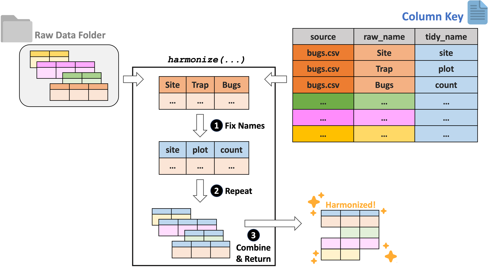

```{r knitr-mechanics, include = F}
knitr::opts_chunk$set(collapse = TRUE, comment = "#>")
```

```{r pre-setup, echo = FALSE, message = FALSE}
# devtools::install_github("lter/ltertools")
```

## Overview

The `ltertools` package 

The goal of `ltertools` is to centralize the R functions created by members of the Long Term Ecological Research (LTER) community. Many of these functions likely have broad relevance that expands beyond the context of their creation and this package is an attempt to share those tools and limit the amount of "re-inventing the wheel" that we each do in our own silos.

The conceptual theme of functions in `ltertools` is necessarily broad given the scope of the community we aim to serve. That said, the identity of this package will likely become more clear as we accrue contributed functions. This vignette describes the main functions of `ltertools` as they currently exist.

```{r setup}
# devtools::install_github("lter/ltertools")
library(ltertools)
```

### Reproducibility

At the LTER Network Office we fund--and work closely with--synthesis working groups. These groups write a lot of code, often in R, in pursuit of their scientific questions. Reproducibility is vital for these collaborative, multi-year groups. To that end, we've developed some functions to try to handle some common reproducibility hurdles these groups face.

Among these issues is the fact that data are often stored in 'the cloud' (e.g., Dropbox, Box, etc.) and accessed via a pseudo-local folder that is "synced". This is not a reproducibility issue in and of itself but it does often push coders to use absolute file paths to reference data files stored in this way. We've discovered that researchers can place their information (including absolute paths) in a local JSON file that is unique to each user but contains the same names with user-specific values. If all users name this file identically then code can be written to access the values stored in the JSON file and make user-specific content be referrable to in a flexible and reproducible way.

`make_json` is meant to make it easier to create this JSON file for each member of a collaboration.

```{r make-json-1}
# Create user-specific information
my_info <- c("data_path" = "Users/me/dropbox/big-data-project/data")

# Generate a local folder for exporting
temp_folder <- tempdir()

# Create a JSON with those contents
make_json(x = my_info, file = file.path(temp_folder, "user.json"))

# Read it back in
(user_info <- RJSONIO::fromJSON(content = file.path(temp_folder, "user.json")))
```

Values in the JSON can be accessed at need but will be personal to each user.

```{r make-json-2}
#| eval: false

df <- read.csv(file = file.path(user_info$data_path, "data_2024.csv"))
```

### Harmonization

The LTER Network is hypothesis-driven with a focus on long term data from sites in the network. This results in data that may reasonably be compared but are--potentially--quite differently formatted based on the logic of the investigators responsible for each dataset. Data harmonization (the process of resolving these formatting inconsistencies to facilitate combination/comparison across projects) is therefore a significant hurdle for many projects using LTER data. We suggest a "column key"-based approach that has the potential to _greatly_ simplify harmonization efforts.

This method requires researchers to develop a 3-column key that contains (1) the name of each raw data file to be harmonized, (2) the name of all of the columns in each of those files, and (3) the "tidy name" that corresponds to each raw column name. Each dataset can then be read in and have its raw names replaced with the tidy ones specified in the key. Once this has been done to all files in the specified folder, they can be combined by their newly consistent column names.

To demonstrate this workflow, we will need to create some example data tables and export them to a temporary directory (so that they can be read back in as is required by the harmonization functions).

```{r harmony-prep-1}
# Generate two simple tables
## Dataframe 1
df1 <- data.frame("xx" = c(1:3),
                  "unwanted" = c("not", "needed", "column"),
                  "yy" = letters[1:3])
## Dataframe 2
df2 <- data.frame("LETTERS" = letters[4:7],
                  "NUMBERS" = c(4:7),
                  "BONUS" = c("plantae", "animalia", "fungi", "protista"))

# Generate a known temporary folder for exporting
temp_folder <- tempdir()

# Export both files to that folder
utils::write.csv(x = df1, file = file.path(temp_folder, "df1.csv"), row.names = FALSE)
utils::write.csv(x = df2, file = file.path(temp_folder, "df2.csv"), row.names = FALSE)
```

While the raw data must be in a folder, the data key is a dataframe in R to allow more flexibility on the user's end about file format / storage (many LTER working groups like generating their key collaboratively as a Google Sheet). For this example, we can generate a data key manually here.

```{r harmony-prep-2}
# Generate a key that matches the data we created above
key_obj <- data.frame("source" = c(rep("df1.csv", 3), 
                                   rep("df2.csv", 3)),
                      "raw_name" = c("xx", "unwanted", "yy",
                                     "LETTERS", "NUMBERS", "BONUS"),
                      "tidy_name" = c("numbers", NA, "letters",
                                      "letters", "numbers", "kingdom"))
# Check that out
key_obj
```

With some example files and a key object generated, we can now demonstrate the actual workflow! The most fundamental of these functions is `harmonize`. This function requires the "column key" described above, as well as the _folder_ containing the raw data files to which the key refers. Raw data format can also be specified to any of CSV, TXT, XLS, and/or XLSX. There is a `quiet` argument that will silence messages about key-to-data mismatches (either expected-but-missing column names or unexpected columns).

```{r harmonize}
# Use the key to harmonize our example data
harmony_df <- ltertools::harmonize(key = key_obj, raw_folder = temp_folder, 
                                   data_format = "csv", quiet = TRUE)

# Check the structure of that
utils::str(harmony_df)
```

For users that want help generating the column key, we have created the `begin_key` function. This function accepts the raw folder and data format arguments included in `harmonize` with an additional (optional) `guess_tidy` argument. If `TRUE`, that argument attempts to "guess" the desired tidy name for each raw column name; it does this by standardizing casing and removing special characters. This may be ideal if you anticipate that many of your raw data files only differ in casing/special characters rather than being phrased incompatibly. For our example here we'll allow the key to "guess".

```{r begin-key}
# Generate a column key with "guesses" at tidy column names
test_key <- ltertools::begin_key(raw_folder = temp_folder, data_format = "csv", 
                                 guess_tidy = TRUE)

# Examine what that generated
test_key
```

A visual version of this column key approach to harmonization is included for convenience here:

<p align="center">

</p>

### Wrangling

Sometimes it is convenient to read in all of the data files from a specified folder. `read` offers the chance to do just that and returns a list where the name of each element is the corresponding file name and the contents of the list element is the full data table. Users may specify the data format or formats they wish to read in. Currently, `read` supports CSV, TXT, XLS, and XLSX files.

We can demonstrate this with the test CSVs we created to demonstrate the harmonization workflow earlier.

```{r read}
# Read in all (both) of the CSVs that we created above
data_list <- ltertools::read(raw_folder = temp_folder, data_format = "csv")

# Check the structure of that
utils::str(data_list)
```

On a different note, the `solar_day_info` function allows you to identify the time of sunrise, sunset, and solar noon (as well as the total length of the day) for each day between a specified start and end date at a set of latitude/longitude coordinates. All times are in UTC and the information retrieved is returned as a dataframe.

```{r solar-day-info}
# Identify day information in Santa Barbara (California) for one week
solar_day_info(lat = 34.41, lon = -119.71, 
               start_date = "2022-02-07", end_date = "2022-02-12", 
               quiet = TRUE)
```

Much of the synthesis work with LTER data--and indeed many ecological research projects generally--requires quantification of _variation_. To that end, we've written a function that simply calculates the coefficient of variation (standard deviation divided by mean) for a vector of numbers. Because `sd` and `mean` both support an argument for defining how missing values are handled, our `cv` function does as well.

```{r cv}
# Calculate CV (excluding missing values)
ltertools::cv(x = c(4, 5, 6, 4, 5, 5), na_rm = TRUE)
```

We also included a simple function for converting temperature values (`convert_temp`) among different accepted units. Simply specify the values to convert, their current units, and the units to which you would like to convert and the function will perform the needed arithmetic. Units are case-insensitive and support either the one-letter abbreviation or the full name of the unit.

```{r convert-temp}
# Convert some temperatures from F to Kelvin
convert_temp(value = c(0, 32, 110), from = "Fahrenheit", to = "k")
```

Note that we chose this function's naming convention in part to allow for an ecosystem of related 'unit conversion' functions that may prove worthwhile to develop.

### LTER Information

The LTER Network is composed of many separate sites. While all of these sites are "long term" they do vary slightly in when they were created. For those interested in knowing the temporal coverage of data from a particular site or group of sites, `site_timeline` can prove a helpful function. This function creates a `ggplot2` timeline where sites are on the vertical axis and years are on the horizontal. Lines are colored based on the habitat of the site and there is support for a user-defined set of hexadecimal colors though by default an internal palette is used.

Sites can be specified by their three letter site code or all sites in a particular habitat can be included.
```{r site-timeline-1, fig.align = 'center', fig.height = 3, fig.width = 7}
# Check the timeline for all grassland or forest LTER sites
ltertools::site_timeline(habitats = c("grassland", "forest"))
```

Running the function without specifying site codes or habitat types will result in a timeline of all active LTER sites.
```{r site-timeline-2, fig.align = 'center', fig.height = 4, fig.width = 7}
# Check the timeline for all LTER sites
ltertools::site_timeline()
```
